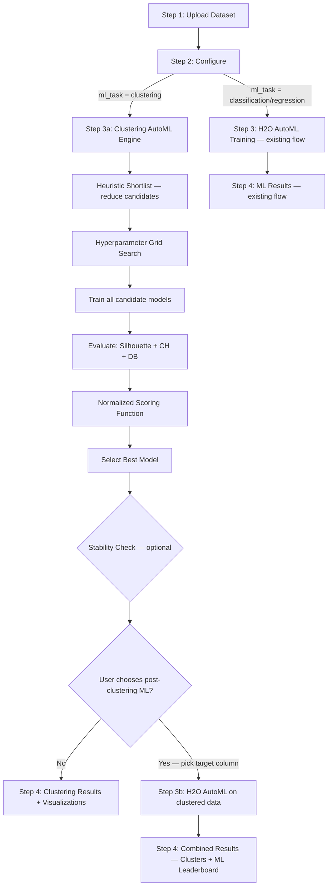
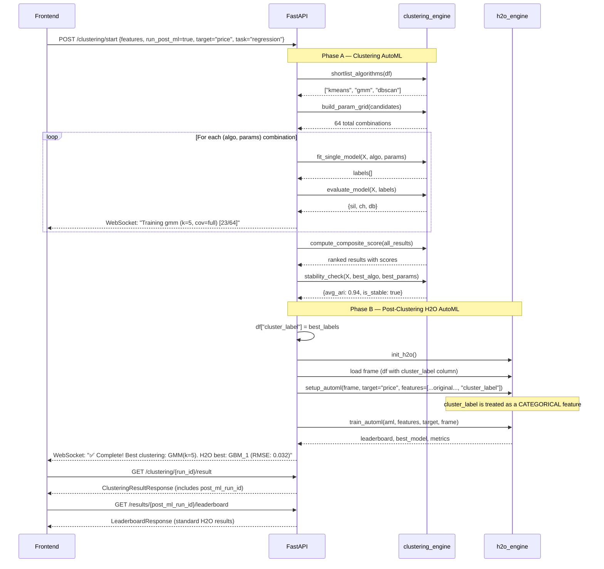

# Hybrid Clustering AutoML + H2O Supervised ML Pipeline

## Goal

Build an **industry-grade two-phase hybrid pipeline** for the AI Kosh platform:

1. **Phase A — Mini AutoML for Clustering**: A fully automated clustering pipeline that **tests multiple algorithms × multiple hyperparameters**, evaluates each with 3 metrics, scores them via a normalized scoring function, and selects the best. This is essentially **AutoML for unsupervised learning**.
2. **Phase B — Post-Clustering H2O Supervised ML**: After clustering, optionally apply H2O AutoML (classification/regression) using `cluster_label` as an additional feature to predict a user-specified target variable.

> **Core Philosophy**: In clustering there is no ground truth — so we **test → measure → compare → select**, just like AutoML does for supervised learning.

---

## User Review Required

> [!IMPORTANT]
> **New Wizard Step**: When the user selects `ml_task = "clustering"` in Step 2 (Configuration), the flow branches into:
> - **Step 3a**: Clustering AutoML (runs KMeans, DBSCAN, GMM with hyperparameter grids → scores → picks best)
> - **Step 3b** *(optional)*: Post-clustering H2O ML (classification/regression on target with `cluster_label` as a feature)
>
> The user will be prompted: *"Do you want to run supervised ML on the clustered data?"* — if yes, they pick a target column and H2O AutoML runs with `cluster_label` as an extra feature.

> [!WARNING]
> **Dependency**: `scikit-learn` is already in `requirements.txt`. No new pip packages needed. DBSCAN and GMM require numeric features — the engine will auto-encode categoricals via one-hot encoding or drop them with a warning.

---

## Architecture Overview



---

## 🔥 The Hybrid Clustering AutoML Pipeline (Core Logic)

This is the heart of the system — a **5-step pipeline** that mirrors how real AutoML systems work, but for unsupervised clustering.

### 🔹 Step 1: Smart Shortlisting (Heuristic Layer)

Use heuristics **only to reduce compute**, not to decide the final model. This saves time on large datasets.

```python
def shortlist_algorithms(df, feature_cols):
    """Heuristic pre-filter to reduce candidate pool."""
    n_rows = len(df)
    n_features = len(feature_cols)
    
    candidates = []
    
    # KMeans — always a candidate (fast, reliable baseline)
    candidates.append("kmeans")
    
    # GMM — always a candidate (probabilistic, handles elliptical clusters)
    candidates.append("gmm")
    
    # DBSCAN — only for datasets large enough to benefit from density-based approach
    if n_rows >= 500:
        candidates.append("dbscan")
    
    return candidates
```

### 🔹 Step 2: Hyperparameter Grid

Each algorithm gets a range of hyperparameters to search over:

```python
PARAM_GRID = {
    "kmeans": [
        {"n_clusters": k} for k in range(2, 11)   # k = 2..10
    ],
    "gmm": [
        {"n_components": k, "covariance_type": cov}
        for k in range(2, 11)
        for cov in ["full", "tied", "diag"]         # 9 × 3 = 27 combos
    ],
    "dbscan": [
        {"eps": eps, "min_samples": ms}
        for eps in [0.1, 0.3, 0.5, 0.7, 1.0, 1.5, 2.0]
        for ms in [3, 5, 10, 15]                    # 7 × 4 = 28 combos
    ],
}
```

### 🔹 Step 3: Train + Evaluate (All Candidates)

For every (algorithm, params) combination, train the model and compute 3 internal validity metrics:

| Metric | Measures | Higher/Lower is Better |
|---|---|---|
| **Silhouette Score** | Cluster cohesion vs separation | Higher ✅ (range: -1 to 1) |
| **Calinski-Harabasz Index** | Ratio of between- to within-cluster variance | Higher ✅ (range: 0 to ∞) |
| **Davies-Bouldin Index** | Average similarity between clusters | Lower ✅ (range: 0 to ∞) |

```python
from sklearn.metrics import silhouette_score, calinski_harabasz_score, davies_bouldin_score

def evaluate_model(X_scaled, labels):
    """Compute all 3 metrics for a single clustering result."""
    # Skip if only 1 cluster or all noise
    n_labels = len(set(labels) - {-1})
    if n_labels < 2:
        return None
    
    # Filter out noise points (DBSCAN label = -1) for metric computation
    mask = labels != -1
    if mask.sum() < 2:
        return None
    
    return {
        "silhouette": silhouette_score(X_scaled[mask], labels[mask]),
        "calinski_harabasz": calinski_harabasz_score(X_scaled[mask], labels[mask]),
        "davies_bouldin": davies_bouldin_score(X_scaled[mask], labels[mask]),
        "n_clusters": n_labels,
        "n_noise": int((~mask).sum()),
    }
```

### 🔹 Step 4: Normalized Scoring Function

The key insight: metrics have different scales. We **normalize** each metric across all candidate results, then apply weighted scoring.

```python
def compute_composite_score(results: list[dict]) -> list[dict]:
    """
    Normalize metrics across ALL candidate results and compute weighted score.
    
    Weights:
      - Silhouette:       0.40 (most interpretable, range-bounded)
      - Calinski-Harabasz: 0.35 (variance-ratio, unbounded → normalize)
      - Davies-Bouldin:    0.25 (lower is better → invert after normalize)
    """
    sil_vals = [r["silhouette"] for r in results]
    ch_vals  = [r["calinski_harabasz"] for r in results]
    db_vals  = [r["davies_bouldin"] for r in results]
    
    def min_max_norm(vals):
        mn, mx = min(vals), max(vals)
        if mx == mn:
            return [0.5] * len(vals)
        return [(v - mn) / (mx - mn) for v in vals]
    
    sil_norm = min_max_norm(sil_vals)   # Higher is better → keep as-is
    ch_norm  = min_max_norm(ch_vals)    # Higher is better → keep as-is
    db_norm  = min_max_norm(db_vals)    # Lower is better  → invert
    
    for i, r in enumerate(results):
        r["score"] = (
            0.40 * sil_norm[i]
          + 0.35 * ch_norm[i]
          - 0.25 * db_norm[i]     # Subtract because lower DB is better
        )
    
    return sorted(results, key=lambda x: x["score"], reverse=True)
```

### 🔹 Step 5: Final Selection + Stability Check

```python
def select_best_model(scored_results):
    """Pick the model with highest composite score."""
    best = scored_results[0]
    return best

def stability_check(X_scaled, algorithm, params, n_runs=5):
    """
    Run the best model N times with different random seeds.
    Measure Adjusted Rand Index (ARI) between runs. 
    High ARI → stable clusters. Low ARI → unstable (warn user).
    """
    from sklearn.metrics import adjusted_rand_score
    
    all_labels = []
    for seed in range(n_runs):
        labels = _fit_model(X_scaled, algorithm, {**params, "random_state": seed})
        all_labels.append(labels)
    
    ari_scores = []
    for i in range(len(all_labels)):
        for j in range(i + 1, len(all_labels)):
            ari_scores.append(adjusted_rand_score(all_labels[i], all_labels[j]))
    
    avg_ari = sum(ari_scores) / len(ari_scores) if ari_scores else 0
    return {
        "avg_ari": round(avg_ari, 4),
        "is_stable": avg_ari > 0.8,
        "n_runs": n_runs,
    }
```

---

## 📊 Overall Pipeline Summary

| Step | What Happens | Industry Equivalent |
|---|---|---|
| **1. Shortlist** | Heuristic reduces algorithm candidates | Feature in Auto-sklearn, TPOT |
| **2. Grid Search** | Generate hyperparameter combinations | GridSearchCV equivalent |
| **3. Train + Evaluate** | Fit all models, compute Sil/CH/DB | Model evaluation phase |
| **4. Score + Rank** | Normalized weighted scoring across all | Leaderboard (like H2O AutoML) |
| **5. Select + Stability** | Pick best, verify consistency | Cross-validation equivalent |
| **6. Post-ML** *(optional)* | H2O AutoML with cluster_label | Transfer learning / feature engineering |

---

## Proposed Changes

### Backend — New Clustering Engine

#### [NEW] [clustering_engine.py](file:///c:/Users/HP/Desktop/AI%20kosh/AI_Kosh_Project/modules/team1_automl/clustering_engine.py)

The core module implementing the entire hybrid clustering AutoML pipeline. **~350-400 lines.**

| Function | Purpose |
|---|---|
| `run_full_pipeline(df, feature_cols, user_prefs)` | End-to-end: shortlist → grid search → train all → score → select best |
| `shortlist_algorithms(df, feature_cols)` | Heuristic pre-filter to reduce candidates |
| `build_param_grid(algorithms)` | Generate hyperparameter grid for each algorithm |
| `fit_single_model(X_scaled, algorithm, params)` | Fit one model, return labels |
| `evaluate_model(X_scaled, labels)` | Compute Silhouette, CH, DB for one model |
| `compute_composite_score(results)` | Normalize all metrics → weighted score → rank |
| `select_best_model(scored_results)` | Return top-scored model |
| `stability_check(X_scaled, algo, params, n_runs)` | Re-run best model N times, compute ARI consistency |
| `prepare_features(df, feature_cols)` | StandardScaler + one-hot encoding for categoricals |
| `get_cluster_summary(df, labels, feature_cols)` | Per-cluster stats: size, centroid, feature distributions |
| `get_elbow_data(X_scaled, max_k)` | Inertia + silhouette for k=2..max_k (KMeans) |
| `reduce_dimensions_pca(X_scaled, labels)` | PCA 2D projection for scatter plot visualization |
| `reduce_dimensions_tsne(X_scaled, labels)` | t-SNE 2D projection for scatter plot visualization |
| `get_feature_importance_per_cluster(df, labels, feature_cols)` | Which features differ most between clusters |

**Internal model fitting abstraction:**

```python
def _fit_model(X_scaled, algorithm, params):
    """Unified interface for all 3 algorithms."""
    if algorithm == "kmeans":
        model = KMeans(n_clusters=params["n_clusters"], random_state=params.get("random_state", 42), n_init=10)
        return model.fit_predict(X_scaled)
    
    elif algorithm == "gmm":
        model = GaussianMixture(
            n_components=params["n_components"],
            covariance_type=params.get("covariance_type", "full"),
            random_state=params.get("random_state", 42),
            n_init=3,
        )
        return model.fit_predict(X_scaled)
    
    elif algorithm == "dbscan":
        model = DBSCAN(eps=params["eps"], min_samples=params["min_samples"])
        return model.fit_predict(X_scaled)
```

---

### Backend — Schema Updates

#### [MODIFY] [schemas.py](file:///c:/Users/HP/Desktop/AI%20kosh/AI_Kosh_Project/modules/team1_automl/schemas.py)

Add new Pydantic models (~80 lines):

```python
# ── Clustering Schemas ──

class ClusteringStartRequest(BaseModel):
    dataset_id: str
    feature_columns: list[str]
    # Optional user overrides (if empty, full AutoML grid runs)
    algorithm: Optional[str] = None        # "kmeans"/"dbscan"/"gmm"/None=auto
    n_clusters: Optional[int] = None       # Override for KMeans/GMM
    eps: Optional[float] = None            # Override for DBSCAN
    min_samples: Optional[int] = None      # Override for DBSCAN
    run_stability_check: bool = True       # Run N-times consistency check
    # Post-clustering ML options
    run_post_ml: bool = False
    post_ml_target: Optional[str] = None
    post_ml_task: Optional[str] = None     # "classification" / "regression"
    post_ml_max_models: int = 10
    post_ml_max_runtime_secs: int = 180

class ClusteringStartResponse(BaseModel):
    run_id: str
    status: str
    message: str

class CandidateModelResult(BaseModel):
    """One row in the clustering 'leaderboard'."""
    rank: int
    algorithm: str
    params: dict
    n_clusters: int
    n_noise_points: int = 0
    silhouette: float
    calinski_harabasz: float
    davies_bouldin: float
    composite_score: float
    is_best: bool = False

class StabilityResult(BaseModel):
    avg_ari: float
    is_stable: bool
    n_runs: int

class ClusterMetrics(BaseModel):
    silhouette_score: float
    calinski_harabasz: float
    davies_bouldin: float
    composite_score: float
    n_clusters: int
    n_noise_points: int = 0

class ClusterSummary(BaseModel):
    cluster_id: int
    size: int
    percentage: float
    centroid: dict           # feature_name -> centroid_value

class ClusterFeatureImportance(BaseModel):
    feature: str
    importance: float        # variance ratio or F-score across clusters

class DimensionReductionPoint(BaseModel):
    x: float
    y: float
    cluster: int

class ClusteringResultResponse(BaseModel):
    run_id: str
    best_algorithm: str
    best_params: dict
    best_metrics: ClusterMetrics
    stability: Optional[StabilityResult] = None
    cluster_summaries: list[ClusterSummary]
    leaderboard: list[CandidateModelResult]     # All tested models ranked
    feature_importance: list[ClusterFeatureImportance]
    feature_columns: list[str]
    total_candidates_tested: int
    pca_points: Optional[list[DimensionReductionPoint]] = None
    # Post-ML results
    post_ml_run_id: Optional[str] = None
    post_ml_status: Optional[str] = None

class ElbowDataPoint(BaseModel):
    k: int
    inertia: float
    silhouette: float

class ElbowResponse(BaseModel):
    run_id: str
    data: list[ElbowDataPoint]
    recommended_k: int
```

---

### Backend — Enum Updates

#### [MODIFY] [enums.py](file:///c:/Users/HP/Desktop/AI%20kosh/AI_Kosh_Project/modules/team1_automl/enums.py)

```python
class ClusteringAlgorithm(str, Enum):
    KMEANS = "kmeans"
    DBSCAN = "dbscan"
    GMM = "gmm"

# Extend TrainingStatus:
class TrainingStatus(str, Enum):
    # ... existing values ...
    CLUSTERING = "clustering"          # Clustering pipeline running
    CLUSTERING_EVAL = "clustering_eval"  # Scoring + ranking candidates
    POST_ML = "post_ml"                # Post-clustering H2O training
```

---

### Backend — Service Layer

#### [MODIFY] [services.py](file:///c:/Users/HP/Desktop/AI%20kosh/AI_Kosh_Project/modules/team1_automl/services.py)

Add clustering orchestration functions (~200 lines):

| Function | Purpose |
|---|---|
| `start_clustering(req)` | Validate inputs, create run, launch `_run_clustering` task |
| `_run_clustering(run_id)` | The main async pipeline — coordinates clustering_engine calls with WebSocket progress updates |
| `get_clustering_status(run_id)` | Return current clustering run status |
| `get_clustering_result(run_id)` | Return full results: leaderboard, metrics, summaries, visualizations |
| `get_elbow_analysis(run_id)` | Return pre-computed elbow data |
| `clustering_websocket(ws, run_id)` | WebSocket for real-time clustering progress |

**`_run_clustering` flow with progress updates:**

```python
async def _run_clustering(run_id: str):
    # 5% — Loading dataset
    await _update_run(run_id, "clustering", 5, "Loading dataset...")
    df = pd.read_csv(filepath)
    
    # 10% — Preparing features
    await _update_run(run_id, "clustering", 10, "Scaling & encoding features...")
    X_scaled, feature_names = clustering_engine.prepare_features(df, feature_cols)
    
    # 15% — Shortlisting algorithms
    await _update_run(run_id, "clustering", 15, "Shortlisting candidate algorithms...")
    candidates = clustering_engine.shortlist_algorithms(df, feature_cols)
    param_grid = clustering_engine.build_param_grid(candidates, user_overrides)
    total_combos = sum(len(v) for v in param_grid.values())
    
    # 20-70% — Training all candidates (bulk of the work)
    all_results = []
    progress = 20
    for algo, params_list in param_grid.items():
        for params in params_list:
            await _update_run(run_id, "clustering", progress,
                f"Training {algo} ({params})... [{len(all_results)+1}/{total_combos}]")
            
            labels = clustering_engine.fit_single_model(X_scaled, algo, params)
            metrics = clustering_engine.evaluate_model(X_scaled, labels)
            if metrics:
                all_results.append({
                    "algorithm": algo, "params": params, "labels": labels, **metrics
                })
            
            progress = min(20 + int(50 * (len(all_results) / total_combos)), 70)
    
    # 75% — Scoring and ranking
    await _update_run(run_id, "clustering_eval", 75, f"Scoring {len(all_results)} models...")
    scored = clustering_engine.compute_composite_score(all_results)
    best = clustering_engine.select_best_model(scored)
    
    # 80% — Stability check
    await _update_run(run_id, "clustering_eval", 80, "Running stability check...")
    stability = clustering_engine.stability_check(X_scaled, best["algorithm"], best["params"])
    
    # 85% — Generating visualizations
    await _update_run(run_id, "clustering_eval", 85, "Generating PCA visualization...")
    pca_points = clustering_engine.reduce_dimensions_pca(X_scaled, best["labels"])
    summaries = clustering_engine.get_cluster_summary(df, best["labels"], feature_cols)
    feat_imp = clustering_engine.get_feature_importance_per_cluster(df, best["labels"], feature_cols)
    
    # 90-100% — Post-clustering ML (if requested)
    if req.run_post_ml and req.post_ml_target:
        await _update_run(run_id, "post_ml", 90, "Starting H2O AutoML on clustered data...")
        df["cluster_label"] = best["labels"]
        # ... launch H2O AutoML with cluster_label as extra feature ...
        await _update_run(run_id, "post_ml", 95, "H2O AutoML training in progress...")
    
    # 100% — Done
    await _update_run(run_id, "complete", 100,
        f"✅ Tested {total_combos} models. Best: {best['algorithm']} (score: {best['score']:.3f})")
```

---

### Backend — Router Updates

#### [MODIFY] [router.py](file:///c:/Users/HP/Desktop/AI%20kosh/AI_Kosh_Project/modules/team1_automl/router.py)

Add new endpoints:

```python
# ── Clustering AutoML ──
@router.post("/clustering/start", response_model=ClusteringStartResponse)
async def start_clustering(req: ClusteringStartRequest):
    return await services.start_clustering(req)

@router.get("/clustering/{run_id}/status")
async def clustering_status(run_id: str):
    return await services.get_clustering_status(run_id)

@router.get("/clustering/{run_id}/result", response_model=ClusteringResultResponse)
async def clustering_result(run_id: str):
    return await services.get_clustering_result(run_id)

@router.get("/clustering/{run_id}/elbow", response_model=ElbowResponse)
async def clustering_elbow(run_id: str):
    return await services.get_elbow_analysis(run_id)

@router.websocket("/ws/clustering/{run_id}")
async def clustering_ws(websocket: WebSocket, run_id: str):
    await services.clustering_websocket(websocket, run_id)
```

---

### Frontend — Type Updates

#### [MODIFY] [types.ts](file:///c:/Users/HP/Desktop/AI%20kosh/UI_kosh/src/pages/model-exchange/tools/types.ts)

Add TypeScript interfaces matching the new backend schemas:

```typescript
export type ClusteringAlgorithm = 'kmeans' | 'dbscan' | 'gmm';

export interface ClusteringStartRequest {
  dataset_id: string;
  feature_columns: string[];
  algorithm?: string;          // null = full AutoML
  n_clusters?: number;
  eps?: number;
  min_samples?: number;
  run_stability_check: boolean;
  run_post_ml: boolean;
  post_ml_target?: string;
  post_ml_task?: MLTask;
  post_ml_max_models?: number;
  post_ml_max_runtime_secs?: number;
}

export interface CandidateModelResult {
  rank: number;
  algorithm: string;
  params: Record<string, unknown>;
  n_clusters: number;
  n_noise_points: number;
  silhouette: number;
  calinski_harabasz: number;
  davies_bouldin: number;
  composite_score: number;
  is_best: boolean;
}

export interface StabilityResult {
  avg_ari: number;
  is_stable: boolean;
  n_runs: number;
}

export interface ClusterMetrics {
  silhouette_score: number;
  calinski_harabasz: number;
  davies_bouldin: number;
  composite_score: number;
  n_clusters: number;
  n_noise_points: number;
}

export interface ClusterSummary {
  cluster_id: number;
  size: number;
  percentage: number;
  centroid: Record<string, number>;
}

export interface ClusterFeatureImportance {
  feature: string;
  importance: number;
}

export interface DimensionReductionPoint {
  x: number;
  y: number;
  cluster: number;
}

export interface ClusteringResultResponse {
  run_id: string;
  best_algorithm: string;
  best_params: Record<string, unknown>;
  best_metrics: ClusterMetrics;
  stability: StabilityResult | null;
  cluster_summaries: ClusterSummary[];
  leaderboard: CandidateModelResult[];
  feature_importance: ClusterFeatureImportance[];
  feature_columns: string[];
  total_candidates_tested: number;
  pca_points: DimensionReductionPoint[] | null;
  post_ml_run_id: string | null;
  post_ml_status: string | null;
}

export interface ElbowDataPoint {
  k: number;
  inertia: number;
  silhouette: number;
}

export interface ElbowResponse {
  run_id: string;
  data: ElbowDataPoint[];
  recommended_k: number;
}
```

Update `WizardState` to include clustering-specific state:

```typescript
export interface WizardState {
  // ... existing fields ...
  clusteringResult: ClusteringResultResponse | null;
}
```

---

### Frontend — API Client Updates

#### [MODIFY] [api.ts](file:///c:/Users/HP/Desktop/AI%20kosh/UI_kosh/src/pages/model-exchange/tools/api.ts)

Add API functions:

```typescript
export const startClustering = async (req: ClusteringStartRequest) => { ... };
export const getClusteringStatus = async (runId: string) => { ... };
export const getClusteringResult = async (runId: string): Promise<ClusteringResultResponse> => { ... };
export const getElbowAnalysis = async (runId: string): Promise<ElbowResponse> => { ... };
export const getClusteringWsUrl = (runId: string) => { ... };
```

---

### Frontend — New Clustering Step Component

#### [NEW] [StepClustering.tsx](file:///c:/Users/HP/Desktop/AI%20kosh/UI_kosh/src/pages/model-exchange/tools/components/StepClustering.tsx)

A dedicated wizard step for the clustering pipeline. Contains these sections:

**Section 1 — Configuration Panel** (before running):
- **Mode Toggle**: "Full AutoML" (test all) vs "Single Algorithm" (user picks one)
- If single mode: algorithm cards (KMeans / DBSCAN / GMM) with parameter inputs
- **Stability Check** toggle (on by default)
- **Post-Clustering ML** section:
  - Toggle: *"Run supervised ML on clustered data?"*
  - If on: target column dropdown + task selector (classification/regression)
  - Max models slider, max runtime slider

**Section 2 — Live Progress** (during execution):
- WebSocket-driven progress bar
- Real-time log showing which model is being trained: `"Training GMM (k=4, cov=full) [12/65]"`
- Live count of candidates tested vs total

**Section 3 — Results Dashboard** (after completion):

| Panel | Content |
|---|---|
| **🏆 Best Model Card** | Algorithm, params, composite score, stability badge |
| **📊 Clustering Leaderboard** | Sortable table of ALL tested models with Sil/CH/DB/Score columns |
| **🍩 Cluster Distribution** | Donut chart showing size of each cluster |
| **📈 Metrics Cards** | Silhouette, Calinski-Harabasz, Davies-Bouldin with color-coded quality indicators |
| **🔵 PCA Scatter Plot** | 2D PCA visualization with clusters color-coded |
| **📉 Elbow Chart** | Interactive line chart: inertia + silhouette vs K |
| **🔍 Feature Importance** | Bar chart: which features differentiate clusters most |
| **📋 Per-Cluster Table** | Expandable rows showing centroid values, size, feature distributions |
| **🔄 Stability Badge** | Green ✅ if ARI > 0.8, Yellow ⚠️ if 0.5-0.8, Red ❌ if < 0.5 |
| **🤖 Post-ML Results** | If post-ML was run: H2O leaderboard + best model card (reuses existing StepResults components) |

---

### Frontend — Configuration Step Update

#### [MODIFY] [StepConfiguration.tsx](file:///c:/Users/HP/Desktop/AI%20kosh/UI_kosh/src/pages/model-exchange/tools/components/StepConfiguration.tsx)

- When `ml_task = "clustering"` is selected:
  - **Hide** target column selector (clustering is unsupervised)
  - **Hide** model selection section (clustering uses its own algorithms, not H2O models)
  - Show info note: *"Clustering will automatically test KMeans, DBSCAN, and GMM with multiple hyperparameters to find the best grouping."*
  - Show note: *"You can optionally choose a target column for post-clustering supervised ML in the next step."*

---

### Frontend — Results Step Update

#### [MODIFY] [StepResults.tsx](file:///c:/Users/HP/Desktop/AI%20kosh/UI_kosh/src/pages/model-exchange/tools/components/StepResults.tsx)

- Add conditional rendering for clustering results using the `ClusteringResultResponse` data
- If `post_ml_run_id` exists, render the **existing** H2O results panels (leaderboard, feature importance, confusion matrix/residuals, predictions) below the clustering results
- Add a visual separator: *"Post-Clustering ML Results (H2O AutoML)"*

---

### Frontend — Wizard Flow Update

#### [MODIFY] [AutoMLWizard.tsx](file:///c:/Users/HP/Desktop/AI%20kosh/UI_kosh/src/pages/model-exchange/tools/AutoMLWizard.tsx)

Update stepper and step rendering:
- When `ml_task = "clustering"`: Steps become **Dataset → Configure → Clustering → Results**
- Step 3 renders `StepClustering` instead of `StepTraining`
- Step labels update dynamically (either "Training" or "Clustering" for step 3)

---

### Styles

#### [MODIFY] [AutoMLWizard.css](file:///c:/Users/HP/Desktop/AI%20kosh/UI_kosh/src/pages/model-exchange/tools/AutoMLWizard.css)

Add styles for:
- Algorithm selection cards with hover effects and active state
- Clustering leaderboard table (alternating rows, score highlight)
- Metric cards with color-coded quality indicators (green/yellow/red)
- PCA scatter plot container
- Elbow chart container
- Cluster distribution donut chart
- Stability badge styles
- Post-ML section separator
- Live progress log with auto-scroll

---

## Post-Clustering H2O ML — Detailed Flow



---

## File Change Summary

| File | Action | Lines | Description |
|---|---|---|---|
| `clustering_engine.py` | **NEW** | ~400 | Core clustering AutoML: multi-model, grid search, scoring, stability, PCA |
| `schemas.py` | MODIFY | +80 | 10 new Pydantic models for clustering pipeline |
| `enums.py` | MODIFY | +10 | `ClusteringAlgorithm` enum, extend `TrainingStatus` |
| `services.py` | MODIFY | +200 | Clustering orchestration, WebSocket progress, post-ML integration |
| `router.py` | MODIFY | +25 | 5 new clustering endpoints |
| `requirements.txt` | NO CHANGE | — | `scikit-learn` already present |
| `types.ts` | MODIFY | +80 | TypeScript interfaces for clustering |
| `api.ts` | MODIFY | +25 | 5 new API client functions |
| `StepClustering.tsx` | **NEW** | ~500 | Full clustering wizard step with config + progress + results |
| `StepConfiguration.tsx` | MODIFY | +15 | Hide target/models for clustering, show info notes |
| `StepResults.tsx` | MODIFY | +50 | Conditional clustering results + post-ML results section |
| `AutoMLWizard.tsx` | MODIFY | +20 | Branching logic for clustering vs supervised flow |
| `AutoMLWizard.css` | MODIFY | +150 | Styles for all new clustering UI components |

---

## Open Questions

> [!IMPORTANT]
> 1. **t-SNE in addition to PCA?** t-SNE gives better non-linear visualizations but is slow on large datasets (>10K rows). Should we offer both with a toggle, or PCA-only for simplicity?
> 2. **Downloadable clustered CSV?** Should the user be able to download the original dataset with `cluster_label` appended as a new column?
> 3. **GMM covariance types**: The grid includes `full`, `tied`, `diag` — this creates 27 combos for GMM alone. Should we limit to `full` only (9 combos) to reduce compute time, or keep all 3 for better coverage?

---

## Verification Plan

### Automated Tests
- Unit tests for `clustering_engine.py`:
  - Test KMeans/GMM on `sklearn.datasets.make_blobs(n_samples=500, centers=4)` → expect 4 clusters
  - Test DBSCAN on `sklearn.datasets.make_moons(n_samples=300, noise=0.1)` → expect 2 clusters + noise
  - Test `compute_composite_score` normalization with known values
  - Test `stability_check` returns ARI > 0.9 for well-separated blobs
  - Test `prepare_features` handles mixed numeric/categorical columns
- API integration tests for all 5 new endpoints
- Test post-clustering H2O flow: cluster → append label → H2O train → verify `cluster_label` in feature importance

### Manual Verification
- Upload Iris dataset → run clustering → verify best model finds ~3 clusters
- Upload noisy synthetic data → verify DBSCAN gets selected and detects noise points
- Run full hybrid flow: cluster → post-ML regression → verify `cluster_label` appears as a feature in H2O results
- Verify WebSocket shows real-time progress with model counts
- Verify PCA scatter plot renders correctly with cluster colors
- Test all UI interactions: algorithm selection, parameter tuning, post-ML toggle
- Test browser on different screen sizes for responsive layout
